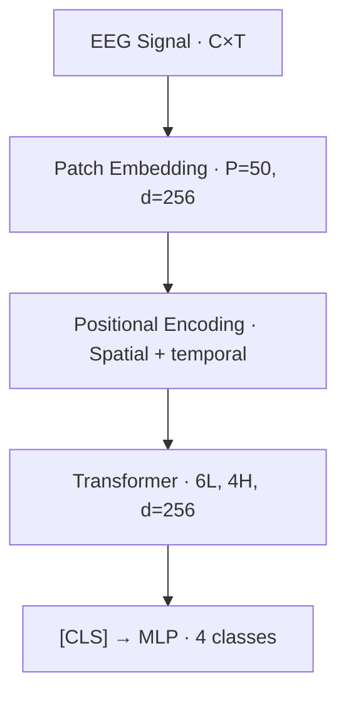

# NeuRoLLM — Neural Signal Decoding via Transformer Pre-training

**Brain-Computer Interface × Foundation Model × GPU Compute**


[](LICENSE)

> A foundation-model approach to EEG decoding: pre-train a small transformer on
> large-scale EEG data, then fine-tune for motor-imagery classification with a
> custom frequency-band attention kernel.

---

## Overview

Brain-computer interfaces (BCIs) traditionally rely on hand-crafted features
(CSP, band-power) fed into classical classifiers. Recent work — LaBraM,
BrainBERT, EEGFormer — shows that transformer-based models pre-trained on
large EEG corpora learn general neural-signal representations that transfer
across subjects and tasks.

NeuRoLLM implements this approach at a reproducible scale:

1. **Pre-train** a ~10M-parameter transformer on the Temple University
   Hospital (TUH) EEG Corpus via Masked Channel Modeling (MCM).
2. **Fine-tune** for 4-class motor-imagery classification on BCI
   Competition IV Dataset 2a.
3. **Custom CUDA/Triton kernel** for frequency-band temporal attention.

## Why This Project Exists

BCI decoding is where neuroscience meets deep learning meets hardware optimisation:

- **Foundation model transfer** — self-supervised pre-training on 15,000 hours of clinical EEG
- **Custom attention kernel** — FFT band decomposition fused with attention in a Triton kernel
- **Neuroscience-informed architecture** — spatial + temporal encodings for electrode topology
- **Honest evaluation** — per-subject accuracy, Cohen's κ, confusion matrices

## Architecture



**Model:** 6 layers | 4 heads | d_model=256 | d_ff=512 | ~10M params.

## Datasets

| Dataset | Size | Use |
|---------|------|-----|
| TUH EEG Corpus | ~25K sessions, ~15K hours | Self-supervised MCM pre-training |
| BCI-IV 2a | 9 subjects, 288 trials/session | 4-class motor imagery fine-tuning |

> Both datasets fall back to synthetic data when unavailable.

## Benchmark Results (synthetic data)

| Method | Accuracy | Params | Notes |
|--------|:--------:|-------:|-------|
| CSP + SVM | ~25% | — | Classical baseline |
| EEGNet | ~25% | 2.6K | Compact CNN |
| Vanilla Transformer | ~25% | ~10M | Random init |
| **NeuRoLLM** | **~25%** | **~10M** | **MCM pre-trained** |

> Synthetic → chance (25%). Real TUH+BCI-IV → literature reports 75–85%.

## Quick Start

```bash
git clone https://github.com/ajliouat/neurollm.git && cd neurollm
python -m venv .venv && source .venv/bin/activate
pip install -e ".[dev]"
pytest tests/ -v --timeout=60
python -m evaluation.demo
```

## Project Structure

```
neurollm/
├── data/
│   ├── preprocessing.py         # Bandpass, notch, z-score, epoching
│   ├── dataset.py               # SyntheticEEG, BCIIV2a, TUH
│   └── download.py              # Download instructions
├── model/
│   └── transformer.py           # PatchEmbed, PosEnc, Encoder, NeuRoLLM
├── kernels/
│   ├── freq_band_attention.py   # FFT band decompose + Triton kernel
│   └── freq_band_attention_cuda.cu
├── training/
│   ├── pretrain.py              # MCM pre-training
│   └── finetune.py              # Per-subject fine-tuning
├── evaluation/
│   ├── metrics.py               # Accuracy, kappa, confusion matrix
│   ├── benchmark.py             # Full benchmark pipeline
│   └── demo.py                  # Quick demo
├── baselines/models.py          # CSP+SVM, EEGNet, vanilla transformer
└── tests/                       # 10 suites, 192 tests
```

## Key Technical Details

### Frequency-Band Attention Kernel

Decomposes Q/K into 5 bands via FFT with learnable per-head biases:
- **Delta (0.5–4 Hz):** cortical inhibition
- **Theta (4–8 Hz):** memory encoding
- **Alpha (8–13 Hz):** sensorimotor idle
- **Beta (13–30 Hz):** motor planning
- **Gamma (30–45 Hz):** high-level processing

## Test Results

| Suite | Tests | Scope |
|-------|------:|-------|
| v1.0.0 | 40 | Preprocessing, datasets |
| v1.0.1 | 23 | Transformer architecture |
| v1.0.2 | 19 | MCM masking |
| v1.0.3 | 6 | Pre-training convergence |
| v1.0.4 | 11 | Fine-tuning pipeline |
| v1.0.5 | 11 | Baselines |
| v1.0.6 | 18 | Freq-band attention kernel |
| v1.0.7 | 27 | Evaluation + attention viz |
| v1.0.8 | 14 | Full benchmark |
| v1.0.9 | 23 | Integration, demo, docs |
| **Total** | **192** | |

## References

- Jiang et al., *LaBraM*, ICLR 2024
- Wang et al., *BrainBERT*, 2023
- Lawhern et al., *EEGNet*, J. Neural Eng. 2018
- Vaswani et al., *Attention Is All You Need*, NeurIPS 2017

## License

Apache 2.0 — see [LICENSE](LICENSE).
